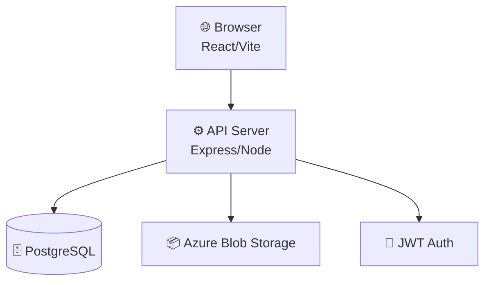
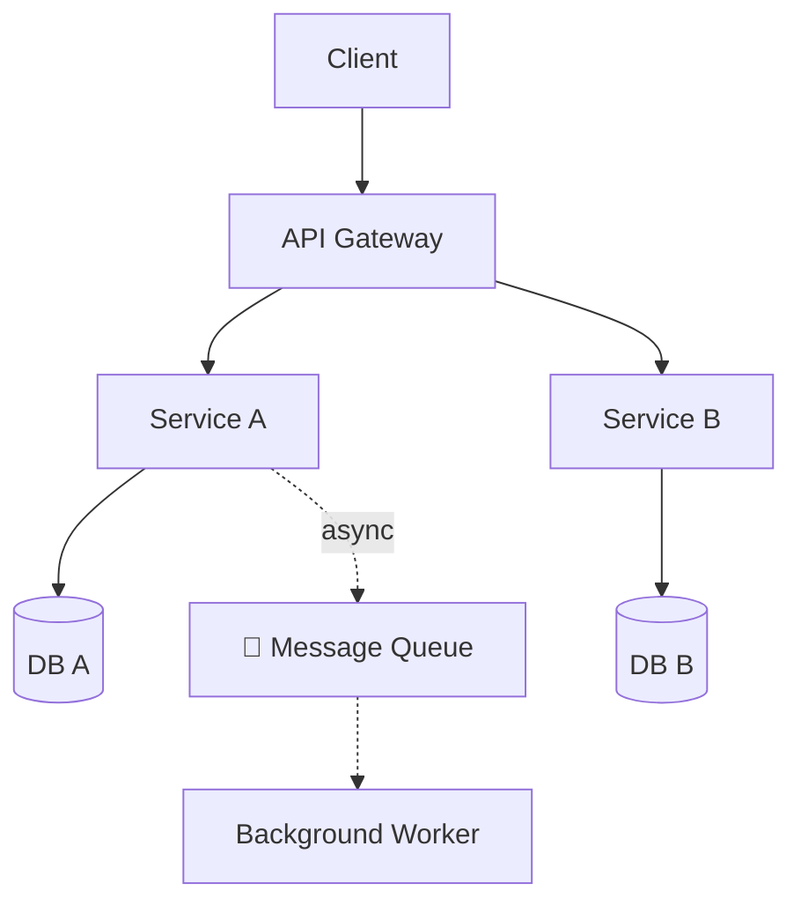
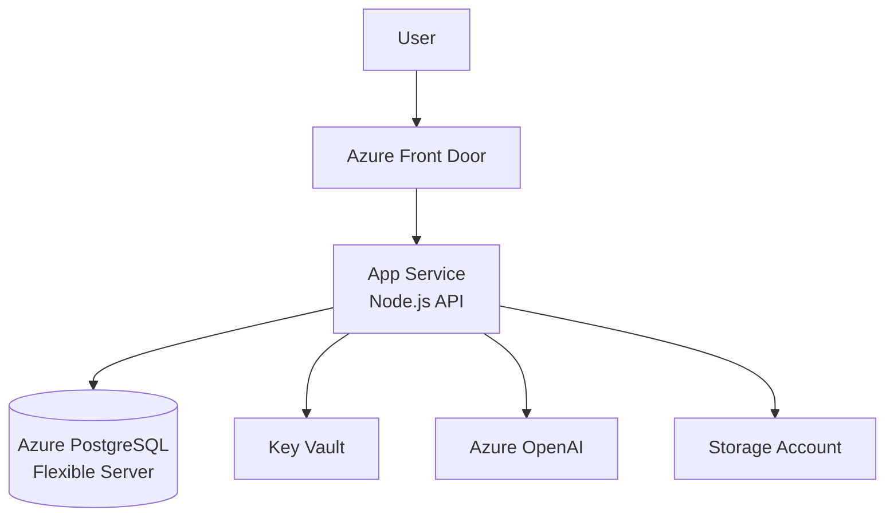

## When to Use
Use when the user asks to:
- "create an architecture diagram"
- "draw the system architecture"
- "visualise how this fits together"
- "diagram the infrastructure"
- "create a component diagram"

## Process

1. **Understand the system** — read key files, entry points, and infrastructure config
2. **Identify components:**
   - Frontend clients (web, mobile, CLI)
   - API/backend services
   - Databases and storage
   - External services (Azure, AWS, third-party APIs)
   - Background workers / queues
3. **Map connections** — what calls what? Which are sync vs async?
4. **Generate the diagram** using Mermaid

## Mermaid Templates

### Simple web app

### Microservices

### Azure infrastructure

## Placement
- Embed the Mermaid block in `docs/architecture.md`
- Or add it to the relevant section of `README.md`
- Reference it from the README if in a separate file

## Rules
- Use emojis sparingly for quick visual parsing
- Keep labels to 3 words max
- Use `subgraph` to group by layer (Frontend / Backend / Data / External)
- Mark async connections with `-.->` 
- Don't try to show everything — focus on the key data flows
