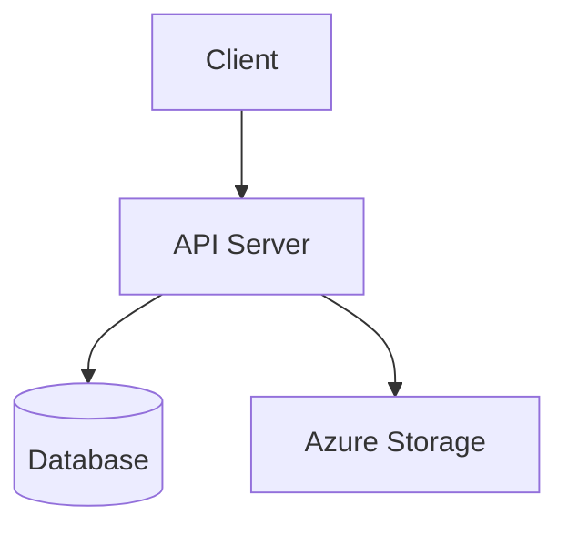

## When to Use
Use when the user asks to:
- "update the architecture diagram"
- "the diagram is out of date"
- "add the new service to the diagram"
- "reflect the latest changes in the diagram"
- "regenerate the diagram"

## Process

1. **Find the existing diagram** — check `docs/`, `README.md`, `*.md` files, `.excalidraw` files
2. **Understand what changed** — read recent commits or the diff
3. **Update the diagram to match the current state**:
   - New services → add boxes/nodes
   - Removed services → remove them
   - New connections → add arrows
   - Changed names → update labels
4. **Verify the updated diagram is internally consistent** — all referenced components exist

## Mermaid updates

Find the `\`\`\`mermaid` block in the relevant markdown file and update it:

Rules for Mermaid:
- Keep labels short (< 4 words)
- Use `-->` for sync, `-.->` for async
- Group related services with `subgraph`

## Excalidraw updates

If the diagram is an `.excalidraw` file, update the JSON:
- Add new element objects to the `elements` array
- Position new elements clearly (don't overlap)
- Use consistent colours: `#e2e8f0` for services, `#fef3c7` for external

## Rules
- Never remove components that still exist in the codebase
- Maintain the same visual style / layout approach as the original diagram
- If the diagram format is unclear, ask before guessing
