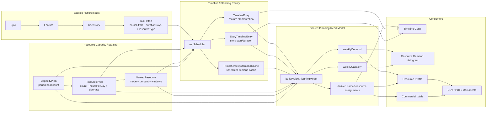
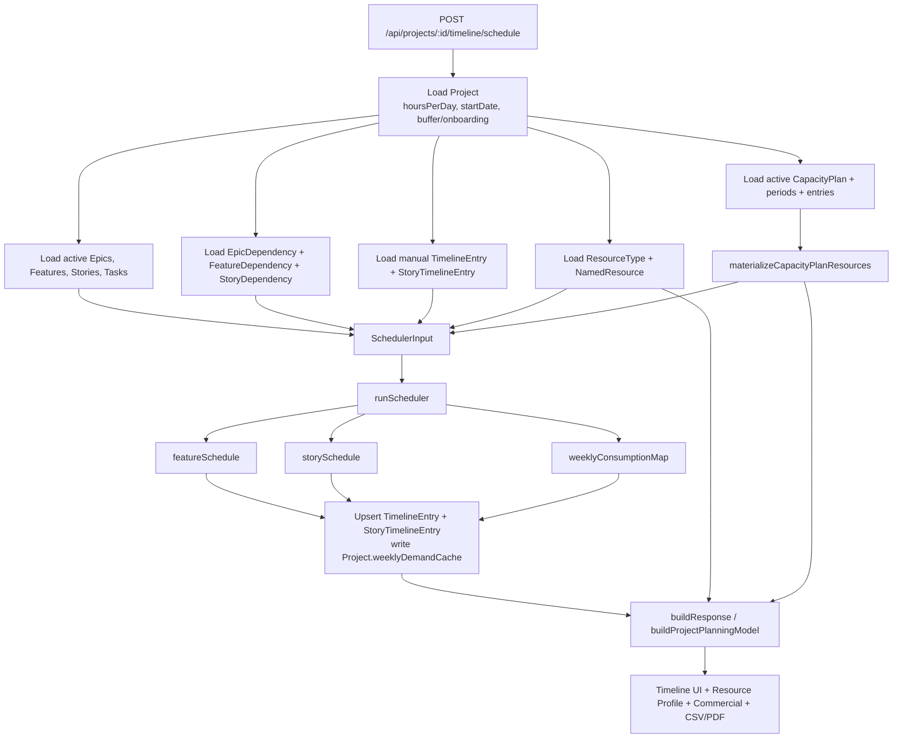
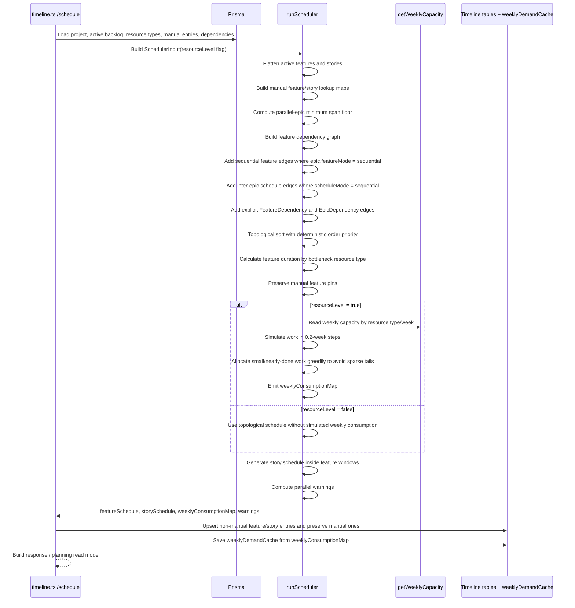
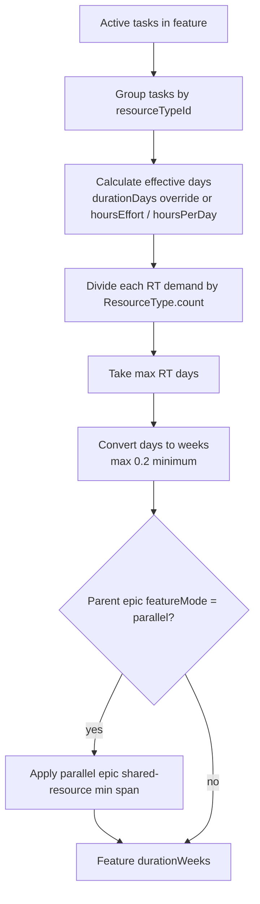
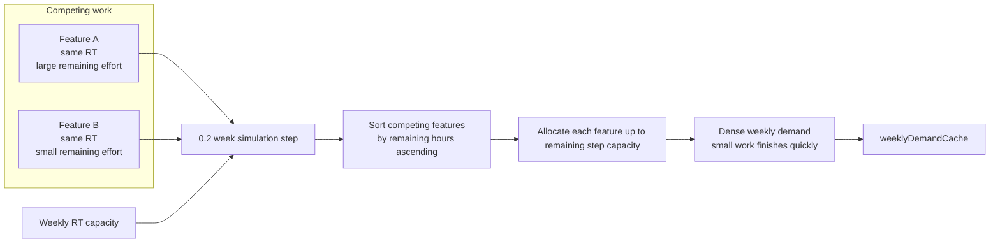
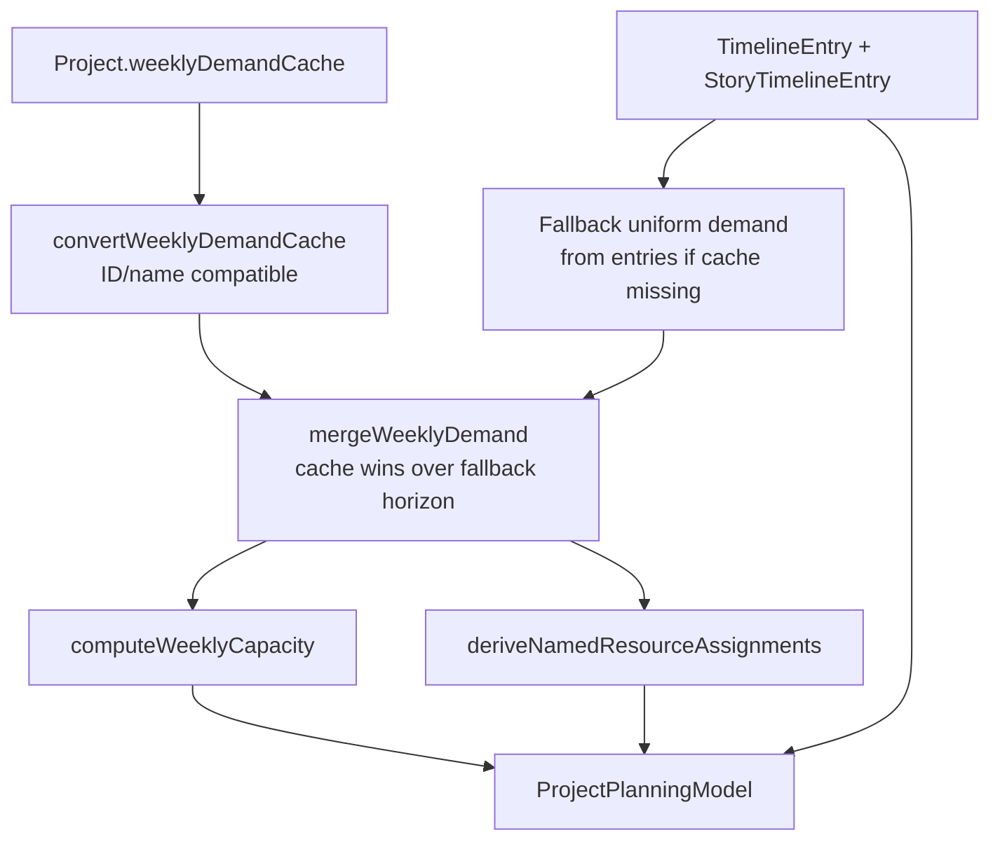
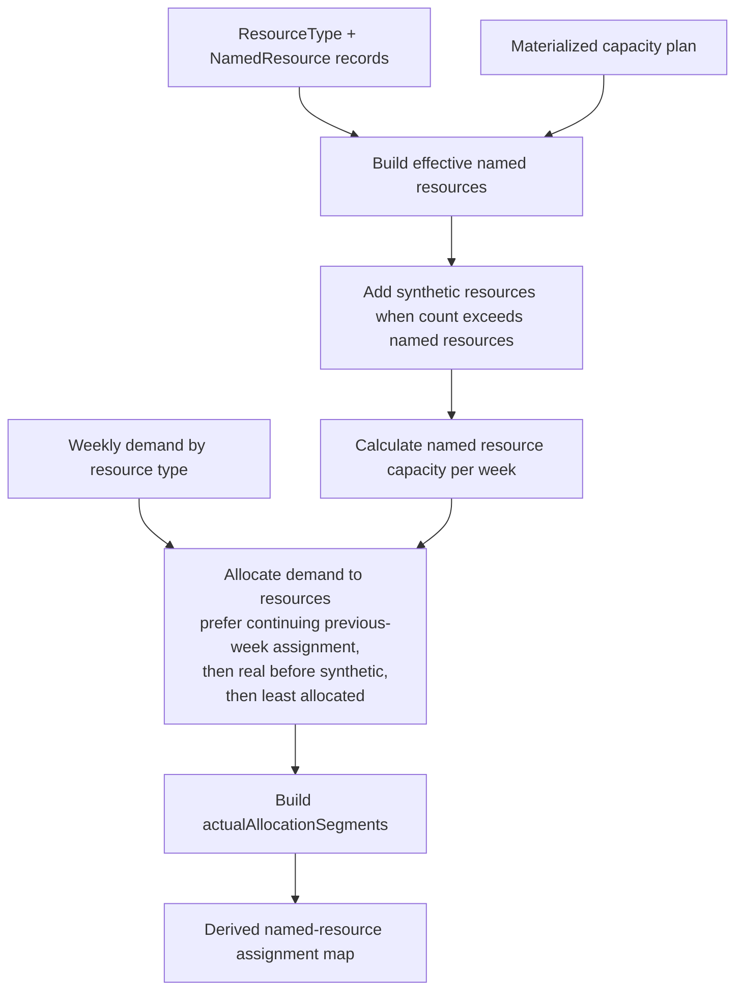
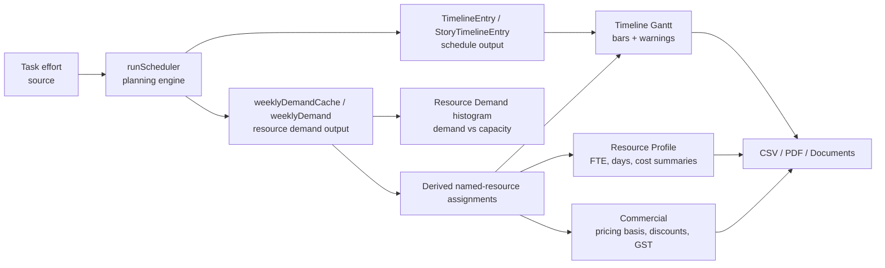

# Scheduling and Resource Model

This guide explains how Monrad Estimator turns backlog effort into a scheduled timeline, weekly resource demand, named-resource assignments, resource profile summaries, commercial totals, and document/export outputs.

It is intentionally architecture-focused rather than user-guide focused. Use it when investigating mismatches between Timeline, Resource Profile, Commercial, CSV, and PDF output.

## Source-of-truth boundaries

The app deliberately separates four related but different concepts:

| Concept | Primary source | Owned by | Notes |
|---|---|---|---|
| Delivery effort | `Task.hoursEffort`, `Task.durationDays`, task `resourceTypeId` | Backlog / Effort Review | This is the estimated work required to deliver the scoped backlog. |
| Scheduling reality | `TimelineEntry`, `StoryTimelineEntry`, `Project.weeklyDemandCache` | Timeline Planner | This is where work lands over time after dependencies, manual overrides, and optional resource levelling. |
| Resource capacity / staffing shape | `ResourceType`, `NamedResource`, `CapacityPlan*` | Resource Profile / planning controls | This describes which role/person/slot capacity is available by week. |
| Commercial pricing | `ResourceType.dayRate`, `NamedResource.pricingModel`, `ProjectOverhead`, `ProjectDiscount`, tax fields | Commercial / Resource Profile presentation | Pricing may use scheduled actual days, pro-rata allocation, full-project allocation, discounts, or overheads. It should not be treated as identical to effort or capacity. |



## Core entity relationship diagram

This ERD focuses on the scheduling/resource-planning domain. It omits unrelated auth, organisation, customer, template, and generated-document details except where they materially affect planning or commercial calculations.


### Source records vs derived/cache records

| Record | Classification | Why it matters |
|---|---|---|
| `Task`, `Epic`, `Feature`, `UserStory` | Source | Owns scope and effort input. |
| `ResourceType`, `NamedResource`, `CapacityPlan*` | Source | Owns capacity/staffing configuration. |
| `ProjectOverhead`, `ProjectDiscount`, rate/tax fields | Source | Owns commercial adjustments. |
| `TimelineEntry`, `StoryTimelineEntry` | Persisted scheduler output | Stores the current schedule, including manual pins. These are planning outputs, not original effort. |
| `Project.weeklyDemandCache` | Derived/cache | Stores scheduler weekly consumption so consumers do not fall back to an approximate uniform spread when resource levelling produced a more specific demand shape. |
| `ProjectPlanningModel` | Read model only | Not persisted. It merges source records, timeline outputs, cache, and fallback calculations for consumers. |
| Named-resource assignments from `deriveNamedResourceAssignments` | Derived | Not persisted. They map weekly demand onto real/synthetic named resources for Timeline, Resource Profile, and Commercial presentation. |

## Scheduling data flow



## Scheduler sequence



## Feature duration and dependency rules

The functional shortcut `sum(task days) / 5` is no longer sufficient to describe current scheduling.

Current feature duration is driven by the bottleneck resource type:

1. Active stories only are considered.
2. Tasks are grouped by `resourceTypeId`.
3. Each task's effective days are calculated from `durationDays` when present, otherwise from `hoursEffort / effectiveHoursPerDay`.
4. For each resource type, person-days are divided by the configured resource type `count`.
5. The largest resource-type duration becomes the feature duration floor, with a minimum of `0.2` weeks.
6. For parallel epics, a shared-resource minimum-span floor is applied so parallel features cannot complete faster than total demand divided by available weekly capacity.



Dependency handling is layered:

| Dependency type | Effect |
|---|---|
| Sequential features within an epic | Adds edges from previous feature to next feature, unless the predecessor is manually pinned. |
| Inter-epic sequential mode | Adds edges from features in earlier epics to the first/current target features in later epics unless the later epic is explicitly parallel or pinned. |
| `FeatureDependency` | Adds explicit feature-to-feature hard constraints. |
| `EpicDependency` | Adds hard constraints from every feature in the predecessor epic to every feature in the dependent epic. |
| `StoryDependency` | Respected when story bars are scheduled/rendered inside feature windows. |
| Manual feature entries | Start/duration are preserved. The scheduler does not move them. |
| Manual story entries | Story start is preserved. |

## Resource capacity calculation

`getWeeklyCapacity` returns capacity in hours for one resource type in one week. Consumers usually convert it back to days by dividing by the resource type's effective hours/day.

```mermaid
flowchart TD
  RT[ResourceType<br/>count, hoursPerDay]
  Week[Week number]
  Named[NamedResource list]
  Each[For each named resource]
  Window{week within<br/>startWeek/endWeek?}
  Mode{allocationMode}
  Effort[EFFORT<br/>100% capacity]
  Full[FULL_PROJECT<br/>allocationPercent all weeks in window]
  Timeline[TIMELINE<br/>allocationPercent only inside allocationStart/End if set]
  CapPlan[CAPACITY_PLAN<br/>capacity from materialized plan]
  SumNamed[Sum named capacity hours]
  Phantom[Phantom slots<br/>max(0, ResourceType.count - namedResources.length) * hpd * 5]
  Total[Weekly capacity hours]

  RT --> Named --> Each --> Window
  Week --> Window
  Window -- no --> SumNamed
  Window -- yes --> Mode
  Mode --> Effort --> SumNamed
  Mode --> Full --> SumNamed
  Mode --> Timeline --> SumNamed
  Mode --> CapPlan --> SumNamed
  RT --> Phantom
  SumNamed --> Total
  Phantom --> Total
```

Important details:

- `ResourceType.count` is the effective headcount for scheduling capacity.
- Named resources are availability/allocation overlays for known people/slots.
- If `count` is greater than the number of named resources, the scheduler treats the extra slots as full-availability phantom staff.
- `CAPACITY_PLAN` mode can materialize capacity-plan periods into slot windows and weekly headcount. If persisted named resources do not match the active plan, capacity-plan fallback creates synthetic slots for planning/read-model consumers.

## Resource levelling and contention

When `resourceLevel` is enabled, `runScheduler` simulates work in small time steps and writes actual weekly consumption into `weeklyConsumptionMap`. This is what later becomes `Project.weeklyDemandCache`.



The sparse-sliver regression from #283 came from proportional allocation leaving tiny remnants spread across many later weeks. PR #290 changed the simulation so smaller/nearly-done competing work is packed greedily within available step capacity. PR #291 separately fixed Timeline named-resource window rendering so EFFORT-mode dashed windows fall back to actual allocation ranges instead of implying broad continuous assignment.

## Shared planning read model

`buildProjectPlanningModel` is the canonical read model for planning-derived facts. It does not own commercial pricing rules and it does not change the backlog effort source records.



Consumers should prefer this read model or its helpers instead of duplicating demand/capacity derivation.

## Named-resource assignment derivation

`deriveNamedResourceAssignments` converts weekly demand rows into per-named-resource actual allocations.



Assignment output includes:

- `actualAllocatedDays`
- `actualAllocationStartWeek`
- `actualAllocationEndWeek`
- `actualAllocatedWeeks`
- `actualAllocationSegments`
- `unallocatedDays` by resource type

This is derived presentation data. It should not be confused with persisted named-resource configuration.

## Cross-surface consistency trace



### Where mismatches usually enter

| Symptom | Likely boundary to inspect |
|---|---|
| Timeline bars move but Resource Profile/Commercial does not change | Query invalidation or a consumer bypassing `ProjectPlanningModel`. |
| Resource Demand differs from named-resource bars | `weeklyDemandCache`, fallback weekly demand, or `deriveNamedResourceAssignments`. |
| Commercial totals differ from actual scheduled days | Pricing basis (`ACTUAL_DAYS` vs `PRO_RATA`), allocation mode, or overhead/discount path. |
| Named resource appears allocated across empty weeks | Rendering using broad start/end windows instead of `actualAllocationSegments` or actual allocation start/end. |
| Over-capacity weeks remain despite spare adjacent capacity | Resource levelling simulation, dependency constraints, manual overrides, or capacity windows. |
| Cloned/copied project loses planning state | Clone path missing dependencies, timeline entries, capacity plans, or `weeklyDemandCache`. |

## Behavioural checklist for changes

When changing scheduling/resource code, verify the following path explicitly:

1. Does the change alter effort source records (`Task`, `hoursEffort`, `durationDays`, `resourceTypeId`)?
2. Does the change alter scheduling outputs (`TimelineEntry`, `StoryTimelineEntry`, `weeklyDemandCache`)?
3. Does the change alter capacity (`ResourceType.count`, `NamedResource`, `CapacityPlan*`, allocation mode/window/percent)?
4. Does the change alter pricing (`dayRate`, `pricingModel`, overheads, discounts, tax)?
5. Are Timeline, Resource Profile, Commercial, CSV, and PDF consuming the same planning facts?
6. Are manual overrides preserved?
7. Are inactive epics/features/stories excluded consistently?
8. Are cache invalidation and fallback demand behaviour still correct?

## Implementation map

| Area | Main files |
|---|---|
| Pure scheduler | `server/src/lib/scheduler.ts` |
| Greedy leveller / optimiser support | `server/src/lib/leveller.ts`, `server/src/lib/optimiser.ts` |
| Timeline API and persistence | `server/src/routes/timeline.ts` |
| Shared planning read model | `server/src/lib/projectPlanningModel.ts` |
| Capacity-plan materialisation | `server/src/lib/capacityPlanMaterialisation.ts` |
| Named-resource assignment derivation | `server/src/lib/namedResourceAssignments.ts` |
| Resource profile/commercial calculations | `server/src/routes/resourceProfile.ts` |
| Timeline UI rendering | `client/src/pages/TimelinePage.tsx`, `client/src/components/timeline/*` |
| Database schema | `server/prisma/schema.prisma` |
