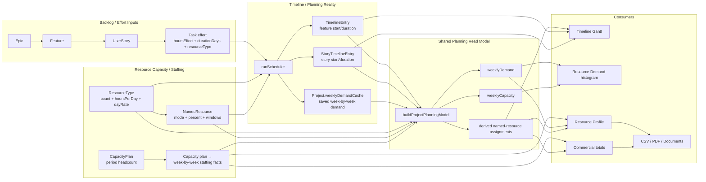
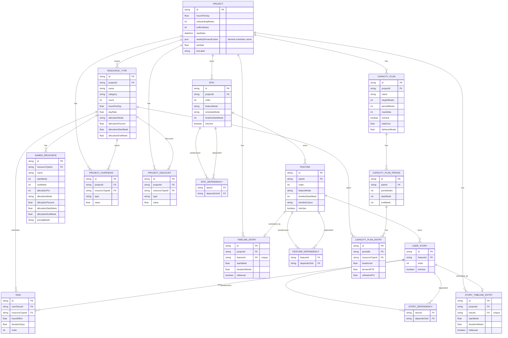
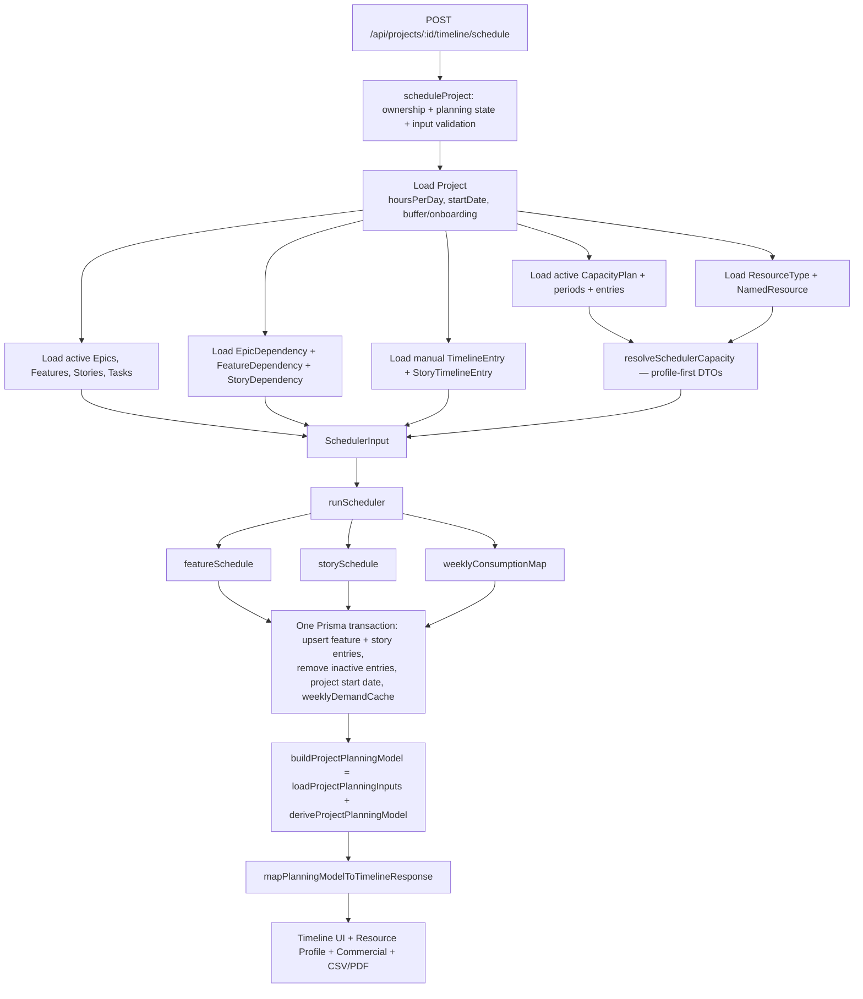
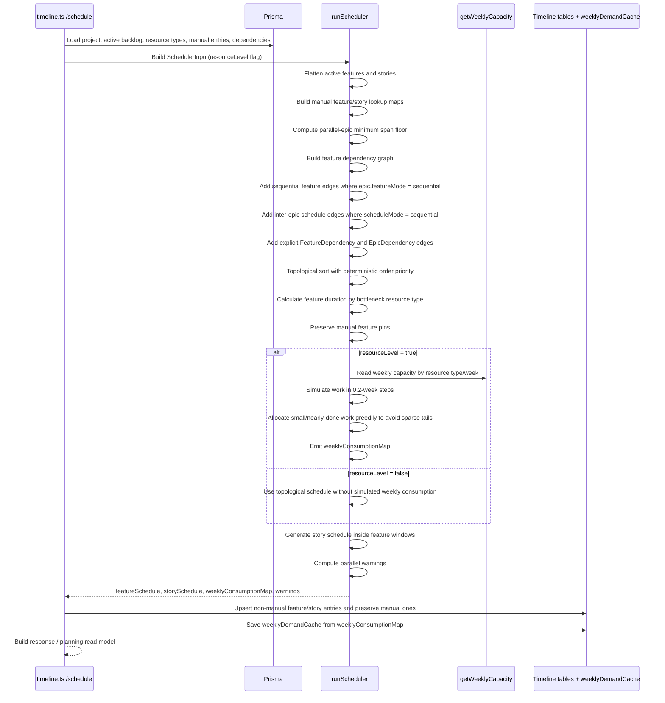
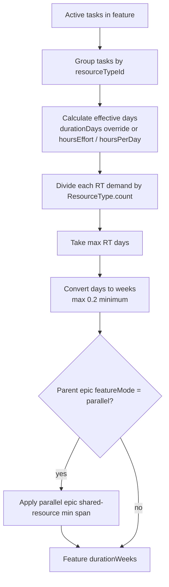
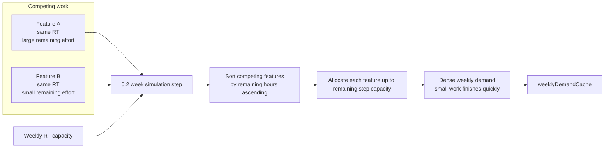
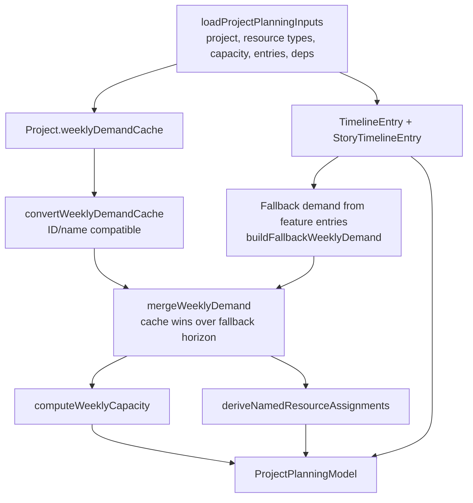
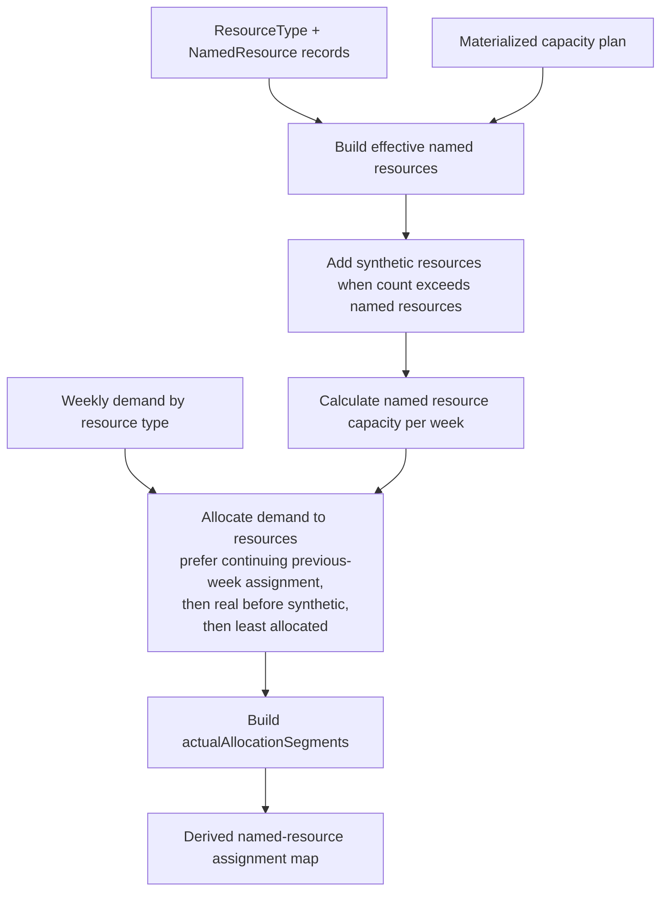
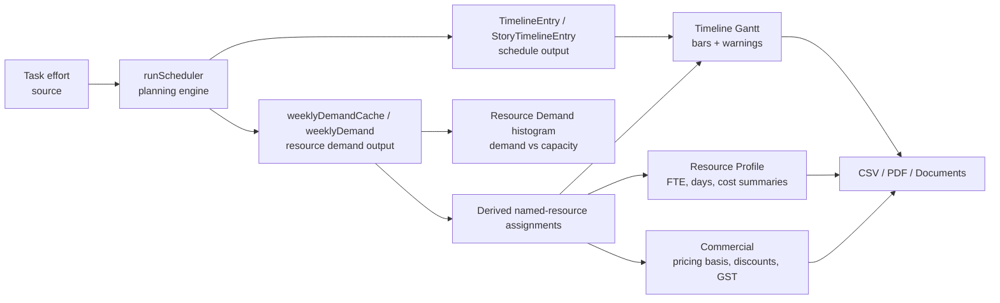

# Scheduling and Resource Model

This guide explains how Monrad Estimator turns backlog effort into a scheduled timeline, weekly resource demand, named-resource assignments, resource profile summaries, commercial totals, and document/export outputs.

It is intentionally architecture-focused rather than user-guide focused. Use it when investigating mismatches between Timeline, Resource Profile, Commercial, CSV, and PDF output.

## Plain-English glossary

A quick reference for terms used throughout this guide:

| Term | What it means |
|---|---|
| **Backlog effort** | The estimated work to do — stored as hours and days on each Task, grouped by resource type. |
| **Schedule / timeline** | When the work happens — feature and story start weeks and durations, plus optional manual pinning. |
| **Capacity** | Who or what role is available in each week — defined by resource type *count* × *hoursPerDay*, optionally shaped by named resources or a capacity plan. |
| **Demand** | How much work each role needs to do each week — produced by the scheduler and cached in `weeklyDemandCache`. |
| **Named resource** | A real person or named staffing slot attached to a resource type. Has its own allocation mode, percentage, and optional window. |
| **Weekly demand cache** | A saved week-by-week breakdown of demand from the last scheduler run. Consumers use it instead of falling back to a rough uniform spread. |
| **Read model** | A combined view built from multiple source records for use by screens and exports. Not a new source of truth — just a query helper. |
| **Derived** | Calculated from other data rather than manually entered. Named-resource assignments, weekly capacity, and the demand cache are all derived. |

## Source-of-truth boundaries

The app deliberately separates four related but different concepts:

| Concept | Primary source | Owned by | Notes |
|---|---|---|---|
| Delivery effort | `Task.hoursEffort`, `Task.durationDays`, task `resourceTypeId` | Backlog / Effort Review | This is the estimated work required to deliver the scoped backlog. |
| Scheduling reality | `TimelineEntry`, `StoryTimelineEntry`, `Project.weeklyDemandCache` | Timeline Planner | This is where work lands over time after dependencies, manual overrides, and optional resource levelling. |
| Resource capacity / staffing shape | `ResourceType`, `NamedResource` | Resource Profile / planning controls | This describes which role/person/slot capacity is available by week. `CapacityPlan` is turned into week-by-week staffing numbers and named-resource windows for the response/shared planning read model, but is **not** passed directly into `runScheduler`. The scheduler currently receives raw `ResourceType.count` values. |
| Commercial pricing | `ResourceType.dayRate`, `NamedResource.pricingModel`, `ProjectOverhead`, `ProjectDiscount`, tax fields | Commercial / Resource Profile presentation | Pricing may use scheduled actual days, pro-rata allocation, full-project allocation, discounts, or overheads. It should not be treated as identical to effort or capacity. |



## Core entity relationship diagram

This section is mainly for developers. It shows the database records involved in scheduling and resource planning.

The ERD focuses on the scheduling/resource-planning domain. It omits unrelated auth, organisation, customer, template, and generated-document details except where they materially affect planning or commercial calculations.


### Source records vs derived/cache records

| Record | Classification | Why it matters |
|---|---|---|
| `Task`, `Epic`, `Feature`, `UserStory` | Source | Owns scope and effort input. |
| `ResourceType`, `NamedResource`, `CapacityPlan*` | Source | Owns capacity/staffing configuration. |
| `ProjectOverhead`, `ProjectDiscount`, rate/tax fields | Source | Owns commercial adjustments. |
| `TimelineEntry`, `StoryTimelineEntry` | Persisted scheduler output | Stores the current schedule, including manual pins. These are planning outputs, not original effort. |
| `Project.weeklyDemandCache` | Derived/cache | Stores scheduler weekly consumption so consumers do not fall back to an approximate uniform spread when resource levelling produced a more specific demand shape. |
| `ProjectPlanningModel` | Read model only | Not persisted. It merges source records, timeline outputs, cache, and fallback calculations for consumers. |
| Named-resource assignments from `deriveNamedResourceAssignments` | Derived | Not persisted. They map weekly demand onto real/synthetic named resources for Timeline, Resource Profile, and Commercial presentation. |

## Scheduling data flow

The schedule endpoint is one focused command (`scheduleProject`), which:

1. **Verify and validate** — ownership check (missing/unauthorised project → 404), planning state guard (NEEDS_REPLAN → 409 REPLAN_REQUIRED), and request input validation (400 on a malformed start date).
2. **Load** the project settings, active backlog, dependencies, manual overrides, resource types, named resources, and the active capacity plan.
3. **Run the scheduler** (`runScheduler`) to decide each feature's start week and duration, each story's placement, and the weekly demand per resource type.
4. **Save atomically** — feature and story `TimelineEntry`/`StoryTimelineEntry` upserts, removal of inactive/superseded generated entries, the applicable project start-date change, and the week-by-week demand cache (`Project.weeklyDemandCache`) all commit in one Prisma transaction. Any failure rolls back the entire update and leaves the previous persisted schedule and cache intact.
5. **Reload** the canonical planning read model (`buildProjectPlanningModel`) and return it, so the post-schedule response is produced by exactly the same derivation and DTO mapping path as `GET /timeline`.

The Mermaid diagram below shows the same flow in more detail.



## Scheduler sequence



## Feature duration and dependency rules

The functional shortcut `sum(task days) / 5` is no longer sufficient to describe current scheduling.

Current feature duration is driven by the bottleneck resource type:

1. Active stories only are considered.
2. Tasks are grouped by `resourceTypeId`.
3. Each task's effective days are calculated from `durationDays` when present, otherwise from `hoursEffort / effectiveHoursPerDay`.
4. For each resource type, person-days are divided by the configured resource type `count`.
5. The largest resource-type duration becomes the feature duration floor, with a minimum of `0.2` weeks.
6. For parallel epics, a shared-resource minimum-span floor is applied so parallel features cannot complete faster than total demand divided by available weekly capacity.



Dependency handling is layered:

| Dependency type | Effect |
|---|---|
| Sequential features within an epic | Adds edges from previous feature to next feature, unless the predecessor is manually pinned. |
| Inter-epic sequential mode | Adds edges from features in earlier epics to the first/current target features in later epics unless the later epic is explicitly parallel or pinned. |
| `FeatureDependency` | Adds explicit feature-to-feature hard constraints. |
| `EpicDependency` | Adds hard constraints from every feature in the predecessor epic to every feature in the dependent epic. |
| `StoryDependency` | Respected when story bars are scheduled/rendered inside feature windows. |
| Manual feature entries | Start/duration are preserved. The scheduler does not move them. |
| Manual story entries | Story start is preserved. |

## Resource capacity calculation

`getWeeklyCapacity` returns capacity in hours for one resource type in one week. Consumers usually convert it back to days by dividing by the resource type's effective hours/day.

```mermaid
flowchart TD
  RT[ResourceType<br/>count, hoursPerDay]
  Week[Week number]
  Named[NamedResource list]
  Each[For each named resource]
  Window{week within<br/>startWeek/endWeek?}
  Mode{allocationMode}
  Effort[EFFORT<br/>100% capacity]
  Full[FULL_PROJECT<br/>allocationPercent all weeks in window]
  Timeline[TIMELINE<br/>allocationPercent only inside allocationStart/End if set]
  CapPlan[CAPACITY_PLAN<br/>capacity from materialized plan]
  SumNamed[Sum named capacity hours]
  Phantom[Phantom slots<br/>max(0, ResourceType.count - namedResources.length) * hpd * 5]
  Total[Weekly capacity hours]

  RT --> Named --> Each --> Window
  Week --> Window
  Window -- no --> SumNamed
  Window -- yes --> Mode
  Mode --> Effort --> SumNamed
  Mode --> Full --> SumNamed
  Mode --> Timeline --> SumNamed
  Mode --> CapPlan --> SumNamed
  RT --> Phantom
  SumNamed --> Total
  Phantom --> Total
```

Important details:

- `ResourceType.count` is the effective headcount for scheduling capacity.
- Named resources are availability/allocation overlays for known people/slots.
- If `count` is greater than the number of named resources, the scheduler treats the extra slots as full-availability phantom staff.
- `CAPACITY_PLAN` mode can materialize capacity-plan periods into slot windows and weekly headcount. If persisted named resources do not match the active plan, capacity-plan fallback creates synthetic slots for planning/read-model consumers.

## Resource levelling and contention

When `resourceLevel` is enabled, `runScheduler` simulates work in small time steps and writes actual weekly consumption into `weeklyConsumptionMap`. This is what later becomes `Project.weeklyDemandCache`.



The sparse-sliver regression from #283 came from proportional allocation leaving tiny remnants spread across many later weeks. PR #290 changed the simulation so smaller/nearly-done competing work is packed greedily within available step capacity. PR #291 separately fixed Timeline named-resource window rendering so EFFORT-mode dashed windows fall back to actual allocation ranges instead of implying broad continuous assignment.

## Shared planning read model

`loadProjectPlanningInputs` + `deriveProjectPlanningModel` (composed by `buildProjectPlanningModel`) is the single place where Timeline, Resource Profile, Commercial, and exports get the same calculated planning view. The pure derivation (`deriveProjectPlanningModel`) imports no Prisma or Express and computes the planning window, weekly demand, weekly capacity, named-resource assignments, and planning warnings from plain inputs; database loading is a thin adapter. The post-schedule response reuses the exact same derivation and DTO mapping path as `GET /timeline`. It does not own commercial pricing rules and it does not change the backlog effort source records.



Consumers should prefer this read model or its helpers instead of duplicating demand/capacity derivation. Timeline and Resource Profile map the same canonical model into their own DTOs.

## Named-resource assignment derivation

`deriveNamedResourceAssignments` converts weekly demand rows into per-named-resource actual allocations.



Assignment output includes:

- `actualAllocatedDays`
- `actualAllocationStartWeek`
- `actualAllocationEndWeek`
- `actualAllocatedWeeks`
- `actualAllocationSegments`
- `unallocatedDays` by resource type

This is calculated display data. It should not be confused with persisted named-resource configuration.

## Cross-surface consistency trace



### Where mismatches usually enter

| Symptom | Likely boundary to inspect |
|---|---|
| Timeline bars move but Resource Profile/Commercial does not change | Query invalidation or a consumer bypassing `ProjectPlanningModel`. |
| Resource Demand differs from named-resource bars | `weeklyDemandCache`, fallback weekly demand, or `deriveNamedResourceAssignments`. |
| Commercial totals differ from actual scheduled days | Pricing basis (`ACTUAL_DAYS` vs `PRO_RATA`), allocation mode, or overhead/discount path. |
| Named resource appears allocated across empty weeks | Rendering using broad start/end windows instead of `actualAllocationSegments` or actual allocation start/end. |
| Over-capacity weeks remain despite spare adjacent capacity | Resource levelling simulation, dependency constraints, manual overrides, or capacity windows. |
| Cloned/copied project loses planning state | Clone path missing dependencies, timeline entries, capacity plans, or `weeklyDemandCache`. |

## Behavioural checklist for changes

When changing scheduling/resource code, verify the following path explicitly:

1. Does the change alter effort source records (`Task`, `hoursEffort`, `durationDays`, `resourceTypeId`)?
2. Does the change alter scheduling outputs (`TimelineEntry`, `StoryTimelineEntry`, `weeklyDemandCache`)?
3. Does the change alter capacity (`ResourceType.count`, `NamedResource`, `CapacityPlan*`, allocation mode/window/percent)?
4. Does the change alter pricing (`dayRate`, `pricingModel`, overheads, discounts, tax)?
5. Are Timeline, Resource Profile, Commercial, CSV, and PDF consuming the same planning facts?
6. Are manual overrides preserved?
7. Are inactive epics/features/stories excluded consistently?
8. Are cache invalidation and fallback demand behaviour still correct?

## Implementation map

| Area | Main files |
|---|---|
| Pure scheduler | `server/src/lib/scheduler.ts` |
| Greedy leveller / optimiser support | `server/src/lib/leveller.ts`, `server/src/lib/optimiser.ts` |
| Timeline API and persistence | `server/src/routes/timeline.ts` |
| Transactional scheduling command | `server/src/lib/scheduleProject.ts` |
| Shared planning read model | `server/src/lib/projectPlanningModel.ts` (`loadProjectPlanningInputs` / `deriveProjectPlanningModel` / `buildProjectPlanningModel`) |
| Capacity-plan materialisation | `server/src/lib/capacityPlanMaterialisation.ts` |
| Named-resource assignment derivation | `server/src/lib/namedResourceAssignments.ts` |
| Resource profile/commercial calculations | `server/src/routes/resourceProfile.ts` |
| Timeline UI rendering | `client/src/pages/TimelinePage.tsx`, `client/src/components/timeline/*` |
| Database schema | `server/prisma/schema.prisma` |

## Profile-first scheduler-capacity resolution

Issue #362 introduced `server/src/lib/schedulerCapacityResolver.ts` — the single shared
boundary for loading and resolving project capacity into scheduler-facing DTOs.
All scheduler consumers (Timeline schedule/GET, Optimiser, Squad Planner,
named-resource assignments) use the same resolved capacity through this adapter.

### Precedence order

For each physical capacity owner (role-level or named/planned resource):

1. **Persisted owner-specific `CapacityProfile`** (`resolutionSource: 'PROFILE'`) — authoritative.
2. **Active Capacity Plan materialisation** (`resolutionSource: 'ACTIVE_CAPACITY_PLAN`) —
   fallback when no valid persisted profile applies.
3. **Legacy compatibility fields** (`resolutionSource: 'LEGACY'`) — final fallback
   from `ResourceType`/`NamedResource` columns.

A valid persisted profile wins even when legacy compatibility fields disagree.

### Segments and gaps

Capacity segments are ordered and preserve:
- exact percentage boundaries per week;
- zero-capacity gaps between segments;
- fractional discontinuous periods.

Capacity is never flattened into a scalar start/end/percentage window.
Legacy allocation fields (`startWeek`, `endWeek`, `allocationPercent`) are consulted
only for `LEGACY`-source resources.

### Squad Planner composition rule

Squad Planner apply persists two representations of the same active plan capacity:

- **Aggregate `ROLE` profile** with `source: 'squadPlanner'` — total headcount.
- **`PLANNED_RESOURCE` profiles** with `source: 'squadPlanner'` — individual
  trajectories (one per planned-resource slot).

The resolver treats both as `PROFILE` source. To avoid double-counting
(adding aggregate role capacity on top of the same planned-resource trajectories),
when an aggregate Squad Planner ROLE profile AND Squad Planner planned-resource
profiles coexist for the same resource type, the aggregate ROLE profile is
**not** exposed as `roleSegments` for scheduler capacity computations.
The planned-resource trajectories remain the schedulable representation.

This affects only scheduler-facing capacity (`schedulerCapacityResolver.ts`).
The aggregate persistred ROLE profile is preserved for Resource Profile,
export, compatibility and other non-scheduler consumers.

A standalone role profile (manual source, no overlapping planned-resource profiles)
continues to contribute `roleSegments` normally.

### Trajectory-to-resource ordering

Persistenced named resources are ordered by `[{ createdAt: 'asc' }, { id: 'asc' }]` to
match the Squad Planner writer ordering. Resources with identical `createdAt`
timestamps (created in the same batch) are tiedbroken by stable ID, ensuring
deterministic trajectory-to-resource mapping and consistent results across
repeated resolution.

### Ownership and composition

| Concern | Behaviour |
|---|---|
| `ResourceType.count` | Remains independent role/headcount metadata. Unchanged by profile resolution. |
| Phantom slots | `max(0, count − namedResources.length)` full-time slots. Used only when no `roleSegments` are present. |
| Role profile | When authoritative, replaces phantom-slot calculation with segment capacity. |
| Named-resource profiles | Per-resource capacity independent of count or phantom slots. |
| Planned-resource profiles | Treated as named resources with `resourceIdentity: 'PLANNED_RESOURCE'`. Individual trajectory capacity. |
| Fractional `Capacity Plan` | Headcount is quantised (0.25 FTE units) and distributed into trajectories. |
| Discontinuous periods | Zero-capacity periods between plan periods are preserved as gaps. |

### Follow-up issues

- **#363** owns first-class profile editing in the UI/API.
- **#364** owns retirement of legacy allocation compatibility fields.
- **#387** owns broader planning-model and transactional scheduling consolidation.

The profile-first resolver does not implement these work items. It only
centralises capacity loading so migrated consumers resolve the same facts.
