# Capacity profile data model plan

> Design/audit PR for #326. This document proposes how to move from the current implicit capacity-profile model to a first-class capacity-profile data model safely.
>
> **This is a design document only. No schema changes, migrations, or runtime behaviour changes have been made.**

## Current state

Capacity profile behaviour is currently represented across multiple Prisma models, server routes, and client hooks. Some concepts are explicit (role-level planning basis, named-resource allocation), some are implicit (capacity over time derived from Squad Planner output), and some are duplicated (both `ResourceType` and `NamedResource` store `allocationMode`, `allocationPercent`, `allocationStartWeek`, `allocationEndWeek`).

The UI has been updated (#328, #329) to use capacity-profile terminology in labels and help text, but the underlying data model still uses the legacy `AllocationMode` enum and duplicated fields.

## Current fields and ownership

### `ResourceType` (Project-scoped role)

| Field | Role | Notes |
|---|---|---|
| `allocationMode` | Planning basis | Enum: `EFFORT`, `TIMELINE`, `FULL_PROJECT`, `CAPACITY_PLAN`. Mixes planning basis with a data-source indicator. |
| `allocationPercent` | Capacity percentage | Default 100. Applied to whole-project allocation. |
| `allocationStartWeek` | Availability start | Used in TIMELINE mode. |
| `allocationEndWeek` | Availability end | Used in TIMELINE mode. |
| `count` | Role headcount | Number of planned staffing slots. |
| `hoursPerDay` | Working hours | Overrideable per role. |
| `dayRate` | Rate | Overrideable per role. |

**Ownership:** Resource Profile owns these as capacity inputs. Timeline/Planning reads them to derive scheduling constraints.

### `NamedResource` (Person or planned slot within a role)

| Field | Role | Notes |
|---|---|---|
| `allocationMode` | Planning basis | Same enum as ResourceType. Duplicated concept. |
| `allocationPct` | Capacity percentage | Int. Duplicated with `allocationPercent`. |
| `allocationPercent` | Capacity percentage | Float. Duplicated with `allocationPct`. |
| `allocationStartWeek` | Availability start | Used in TIMELINE mode. |
| `allocationEndWeek` | Availability end | Used in TIMELINE mode. |
| `startWeek` | Availability start | Int version. Relationship to `allocationStartWeek` unclear. |
| `endWeek` | Availability end | Int version. Relationship to `allocationEndWeek` unclear. |
| `pricingModel` | Billing basis | String: `ACTUAL_DAYS` / `PRO_RATA`. Belongs to Commercial domain. |
| `name` | Person or slot name | Display name. `proposedName` on the parent ResourceType suggests planned naming. |

**Ownership:** Resource Profile owns the person/slot metadata. Commercial owns `pricingModel`. Timeline/Planning reads the allocation fields to derive assignments.

### `CapacityPlan` / `CapacityPlanPeriod` / `CapacityPlanEntry` (Squad Planner output)

| Model | Role |
|---|---|
| `CapacityPlan` | A generated plan with target/period weeks, activation flag, cost/delivery summary. |
| `CapacityPlanPeriod` | A time span within a plan (e.g. monthly or quarterly). |
| `CapacityPlanEntry` | Headcount/demand for one resource type within one period. |

**Ownership:** Squad Planner generates these. The `materializeCapacityPlanResources` function converts them into weekly capacity that Timeline/Planning can consume.

**Problem:** CapacityPlan is a project-level construct (linked to `Project`, not to individual `ResourceType` or `NamedResource`). A plan contains headcount numbers per resource type per period, but there is no first-class model linking a capacity profile to a specific role, person, or planned resource with segmented time windows.

### `Project` (Shared settings)

| Field | Role |
|---|---|
| `bufferWeeks` | Schedule buffer |
| `onboardingWeeks` | Ramp-up time |
| `hoursPerDay` | Default working hours |
| `startDate` | Project start |

## Problems with the current model

1. **Capacity fields are duplicated across ResourceType and NamedResource.** Both models carry `allocationMode`, `allocationPercent`, `allocationStartWeek`, `allocationEndWeek`. This creates two sources of truth and inconsistency risk.

2. **`NamedResource` has redundant capacity fields.** `allocationPct` (Int) and `allocationPercent` (Float) appear to have been added without removing the older field. Likewise `startWeek`/`endWeek` vs `allocationStartWeek`/`allocationEndWeek`.

3. **`AllocationMode` enum mixes concepts.** `EFFORT` means "demand-following", `TIMELINE` means "availability window", `FULL_PROJECT` means "whole-project allocation", `CAPACITY_PLAN` means "use the Squad Planner output as the capacity source". The last value names a data source, not a planning basis.

4. **No segmented capacity model at the role/person level.** Variable capacity over time (ramp-up → sustain → ramp-down) is only representable through the Squad Planner's project-level `CapacityPlan` model. A role or named person cannot have a segmented capacity profile directly.

5. **CapacityPlan is not linked to individual roles or named resources.** It aggregates headcounts per resource type per period, but you cannot say "this named person has this capacity profile with these segments."

6. **`pricingModel` on NamedResource is a Commercial concept stored in the Resource Profile domain.** This couples planning and pricing at the data level.

7. **Implicit capacity from `ResourceType.count`.** The count field represents planned staffing slots. When count > number of named resources, the remaining capacity is an implicit role-level pool. This is correct behaviour but not explicitly modelled.

## Target concepts

These are the target domain concepts that should be represented in a first-class data model:

### Capacity profile

A capacity profile belongs to an **owner** (a role, a named person, or a planned resource). It describes how much of that owner is available over time.

A capacity profile has:
- A **planning basis** (demand-following, availability window, whole-project allocation, or segmented/manual profile).
- Zero or more **capacity segments** that define capacity over specific week ranges.

### Capacity segment

A segment is one piece of a capacity profile:

- `startWeek`, `endWeek` — the week range.
- `capacityPercent` — how much of the owner's full capacity is available in this range (100% = full-time).
- `source` — where this segment came from (manual, Squad Planner, imported, derived).

Segments allow modelling "50% in weeks 1–4, 100% in weeks 5–10, 25% in weeks 11–14" without implying multiple people.

### Planning basis

The planning basis answers "how is this capacity profile applied to scheduling?"

- **Demand-following** — schedule only what the work demands, up to available capacity.
- **Availability window** — the resource is available for a fixed start/end window at a given percentage.
- **Whole-project allocation** — the resource is allocated for the full project duration.
- **Capacity profile** — the resource follows a segmented/ramp profile (may be generated by Squad Planner or manually defined).

### Assigned work

Assigned work is an **output** of scheduling/planning, not the same as capacity. It represents the days actually scheduled to a role or person.

### Billing basis

Billing basis is a **Commercial** concept, not a planning concept:
- Bill actual scheduled days.
- Bill planned allocation.
- Bill whole-project allocation.
- Exclude / non-billable.

## Proposed first-class model

> **This is a proposed design only. No schema changes have been made.**

The central idea: introduce a `CapacityProfile` model that links to its owner (role or named resource) and contains segments. The existing `allocationMode`/`allocationPercent`/`allocationStartWeek`/`allocationEndWeek` fields on `ResourceType` and `NamedResource` become the **source of truth for simple profiles**, with the `CapacityProfile` model as the richer representation. Over time, the simple fields are derived from or replaced by the profile model.

### Candidate Prisma shape (proposed only)

```prisma
/// First-class capacity profile model.
/// Initially populated from existing ResourceType/NamedResource fields
/// via a migration helper, then becomes the source of truth.
model CapacityProfile {
  id             String   @id @default(cuid())
  projectId      String
  project        Project  @relation(fields: [projectId], references: [id], onDelete: Cascade)

  /// Polymorphic owner: either a ResourceType (role-level) or NamedResource (person/planned resource).
  resourceTypeId   String?
  resourceType     ResourceType?  @relation(fields: [resourceTypeId], references: [id], onDelete: Cascade)
  namedResourceId  String?
  namedResource    NamedResource? @relation(fields: [namedResourceId], references: [id], onDelete: Cascade)

  /// Planning basis: how this profile is applied to scheduling.
  planningBasis    PlanningBasis @default(DEMAND_FOLLOWING)

  /// For simple profiles (availability window or whole-project allocation):
  defaultPercent   Float?         // capacity percentage when not using segments
  startWeek        Float?
  endWeek          Float?

  /// Segmented profile (used when planningBasis is CAPACITY_PROFILE or when
  /// the profile has multiple segments).
  segments         CapacitySegment[]

  /// Source of the profile data.
  source           String  @default("manual")  // 'manual' | 'squadPlanner' | 'imported' | 'migrated'

  createdAt        DateTime @default(now())
  updatedAt        DateTime @updatedAt

  @@unique([projectId, resourceTypeId])
  @@unique([projectId, namedResourceId])
  @@index([projectId])
}

model CapacitySegment {
  id               String   @id @default(cuid())
  profileId        String
  profile          CapacityProfile @relation(fields: [profileId], references: [id], onDelete: Cascade)
  startWeek        Float
  endWeek          Float
  capacityPercent  Float    @default(100)
  source           String   @default("manual")   // 'manual' | 'squadPlanner' | 'imported' | 'derived'
  order            Int      @default(0)
}

enum PlanningBasis {
  DEMAND_FOLLOWING
  AVAILABILITY_WINDOW
  WHOLE_PROJECT_ALLOCATION
  CAPACITY_PROFILE        // segmented/manual profile
}
```

### API shape (proposed only)

```typescript
// GET /api/projects/:id/capacity-profiles
type CapacityProfileDTO = {
  id: string
  owner: {
    kind: 'role' | 'namedPerson' | 'plannedResource'
    id: string
    name: string
  }
  planningBasis: 'demandFollowing' | 'availabilityWindow' | 'wholeProjectAllocation' | 'capacityProfile'
  defaultPercent?: number
  startWeek?: number
  endWeek?: number
  segments: CapacitySegmentDTO[]
  source: string
}

type CapacitySegmentDTO = {
  id: string
  startWeek: number
  endWeek: number
  capacityPercent: number
  source: string
}
```

### Migration of existing fields

| Current field | Target |
|---|---|
| `ResourceType.allocationMode` | → `CapacityProfile.planningBasis` (mapped: EFFORT→DEMAND_FOLLOWING, TIMELINE→AVAILABILITY_WINDOW, FULL_PROJECT→WHOLE_PROJECT_ALLOCATION, CAPACITY_PLAN→CAPACITY_PROFILE) |
| `ResourceType.allocationPercent` | → `CapacityProfile.defaultPercent` |
| `ResourceType.allocationStartWeek` | → `CapacityProfile.startWeek` |
| `ResourceType.allocationEndWeek` | → `CapacityProfile.endWeek` |
| `NamedResource.allocationMode` | → `CapacityProfile.planningBasis` (same mapping) |
| `NamedResource.allocationPercent` | → `CapacityProfile.defaultPercent` |
| `NamedResource.allocationPct` | Removed (redundant with `allocationPercent`) |
| `NamedResource.allocationStartWeek` | → `CapacityProfile.startWeek` |
| `NamedResource.allocationEndWeek` | → `CapacityProfile.endWeek` |
| `NamedResource.startWeek` | → `CapacityProfile.startWeek` (consolidated) |
| `NamedResource.endWeek` | → `CapacityProfile.endWeek` (consolidated) |
| `NamedResource.pricingModel` | Stays on NamedResource but re-labelled; ownership clarified as Commercial domain |
| `CapacityPlan` + periods + entries | → Generates `CapacityProfile` records with `source: 'squadPlanner'`; the plan itself may remain as a generation input/audit log |

### Key design decisions

1. **Polymorphic owner**: A CapacityProfile belongs to either a ResourceType (role-level) or a NamedResource (person or planned resource). This avoids a separate model for each owner type.

2. **Simple + segmented in one model**: Profiles that represent a single availability window or whole-project allocation store their data in `defaultPercent`/`startWeek`/`endWeek`. Profiles with variable capacity over time use `segments`. The `planningBasis` field determines which interpretation applies.

3. **Existing fields remain during migration**: Legacy fields on ResourceType and NamedResource are not removed immediately. They become **derived** from the CapacityProfile (or kept in sync via triggers/application logic) until the migration is complete.

4. **CapacityPlan not replaced**: The Squad Planner's `CapacityPlan`/`CapacityPlanPeriod`/`CapacityPlanEntry` models remain as the **generation input and audit log**. When a plan is "applied", it creates or updates `CapacityProfile` records for the affected resource types with `source: 'squadPlanner'`. The plan itself stays as a record of what was generated.

## Migration approach

### PR 1: Read-only mapping helpers (this PR — design only)

Add pure mapping functions that convert existing fields to the proposed DTO shape. These functions:
- Accept the current `ResourceType` and `NamedResource` records as input.
- Return `CapacityProfileDTO` structures.
- Preserve all existing behaviour — the helpers are **read-only** and not consumed by any route yet.

Tests prove that the DTO output matches the current implicit capacity profile behaviour.

### PR 2: Add read-only API endpoint

Add `GET /api/projects/:id/capacity-profiles` that returns capacity profiles derived from existing fields via the mapping helpers. The existing Resource Profile, Timeline, and Commercial routes are unchanged. Add integration tests comparing the new endpoint against existing route data.

### PR 3: Add CapacityProfile model + migration helper

Add the `CapacityProfile` and `CapacitySegment` Prisma models. Add a migration that populates them from existing `ResourceType` and `NamedResource` fields. The helper is **additive** — it creates profile records for existing data without changing any existing fields.

**Backward compatibility:** All old fields remain functional. The migration helper can be re-run for existing projects that were created before the model existed.

### PR 4: Wire server routes to consume CapacityProfile

Update the Resource Profile route (`resourceProfile.ts`), Timeline route (`timeline.ts`), and Squad Planner apply route (`squadPlan.ts`) to read from `CapacityProfile` where available, falling back to the legacy fields for projects without profiles.

The `materializeCapacityPlanResources` function is updated to prefer profile segments over plan entries when a profile exists.

### PR 5: Wire client to consume CapacityProfile

Update `useResourceProfile.ts`, `useAllocationEditing.ts`, and `SquadPlannerDrawer.tsx` to read from the new capacity-profile endpoint and write through it where appropriate.

The existing allocation editing UI continues to work — it now reads/writes the profile model behind the same user-facing controls.

### PR 6: UI for segmented capacity editing

Add a segmented-profile editor in the Resource Profile tab (capacity profile detail panel). This is where users can manually define ramp-up/sustain/ramp-down segments.

### PR 7: Squad Planner generates CapacityProfile segments

When Squad Planner output is applied, it creates or updates `CapacityProfile` records with `source: 'squadPlanner'` and the appropriate segments, rather than only persisting to the `CapacityPlan` model.

### PR 8: Retire legacy fields (optional, future)

Once all projects have been migrated and all routes consume the new model, redundant fields on `ResourceType` and `NamedResource` can be deprecated and eventually removed. This is a separate PR well after the migration is proven stable.

## API impact

No API changes in this PR. Future API changes:

1. **New read-only endpoint** (`GET /api/projects/:id/capacity-profiles`) — additive, does not change existing endpoints.
2. **New/updated mutation endpoints** for writing capacity profiles — replaces some PATCH calls to `/resource-types/:id` and `/named-resources/:id` for allocation editing.
3. **Squad Planner apply response** includes `source: 'squadPlanner'` profile data — additive to the existing response.
4. **Legacy fields remain in existing responses** until migration is complete.

## UI impact

No UI changes in this PR. Future UI changes:

1. **Resource Profile tab** — capacity profile detail panel showing segments with inline editing.
2. **Allocation editing** — reads/writes through capacity-profile endpoint.
3. **Squad Planner** — apply creates profile segments visible in Resource Profile.
4. **Export** — capacity profile columns use the new structured data.

## Export impact

No export changes in this PR. Future export improvements:

1. Capacity profile columns can export structured segment data (label already supports "Capacity profile").
2. Handover CSV can include per-segment rows for named resources and planned resources.

## Testing approach

### Phase 1: Mapping helper tests (PR 1-2)

- Input a `ResourceType` with `allocationMode: 'TIMELINE'`, `allocationPercent: 75`, `allocationStartWeek: 2`, `allocationEndWeek: 10`.
- Assert the helper produces a `CapacityProfileDTO` with `planningBasis: 'availabilityWindow'`, `defaultPercent: 75`, `startWeek: 2`, `endWeek: 10`, empty segments.
- Input a `ResourceType` with `allocationMode: 'CAPACITY_PLAN'` and an active `CapacityPlan` with periods.
- Assert the helper produces a `CapacityProfileDTO` with `planningBasis: 'capacityProfile'` and the correct segments derived from the plan periods.
- Edge cases: null values, zero percent, missing plan, role with named resources vs without.

### Phase 2: Integration tests (PR 3-4)

- New endpoint returns profiles matching existing route data (Resource Profile, Timeline).
- Migration helper creates correct profiles for existing projects.
- Backward compatibility: existing routes return same data before and after migration.

### Phase 3: Client tests (PR 5-6)

- Hooks return correct profile data.
- UI renders segments correctly.
- Editing a profile updates both the new model and the derived legacy fields.

### Phase 4: Full regression (PR 7-8)

- Squad Planner apply creates profiles.
- Resource Profile, Timeline, Commercial, and export output unchanged.
- No data loss for existing projects.

## Rollout plan

```mermaid
graph LR
    A[PR 1: Design doc] --> B[PR 2: Read mapping + tests]
    B --> C[PR 3: Read-only API endpoint + tests]
    C --> D[PR 4: Schema + migration helper + backward compat]
    D --> E[PR 5: Server routes consume new model]
    E --> F[PR 6: Client read/write new model]
    F --> G[PR 7: Segmented UI editor]
    G --> H[PR 8: Squad Planner generates profiles]
    H --> I[PR 9: Retire legacy fields]
```



Each PR is independently mergeable and backward-compatible. The rollout pauses if any regression is detected.

## Open questions

1. **Should `CapacityPlan` remain as a separate model or fold into `CapacityProfile`?** The current design keeps it as a generation audit log. If Squad Planner's generated output is always stored as profiles, the plan model could be simplified or removed later.

2. **How should `CapacityProfile` interact with `ResourceType.count`?** A role with `count: 3` expects up to 3 units of capacity. If a profile exists, does it represent the capacity of one unit or the aggregate of all units? Proposal: the profile represents one **staffing slot** within the role. Multiple slots share the role's profile. This avoids N profiles for N counts.

3. **Should `NamedResource` `pricingModel` move to a Commercial model?** Current proposal: keep it on `NamedResource` but rename the field and clarify ownership through the API. A full move to Commercial is a separate concern (#322 follow-up).

4. **What happens to `CapacityPlan` during the migration?** Existing plans remain in the database. The migration helper converts their periods into capacity-profile segments on the linked resource types. The `CapacityPlan` records stay as audit history.

5. **Should segments always be explicit, or should simple profiles (availability window, whole-project) remain as flat fields?** Current proposal: both. Simple profiles use `defaultPercent`/`startWeek`/`endWeek`. Segmented profiles use the `segments` relation. The `planningBasis` field disambiguates.

## Explicitly out of scope for this PR

This is a **design and audit PR only**:

- ❌ No Prisma schema changes.
- ❌ No migrations created or run.
- ❌ No runtime behaviour changes.
- ❌ No API endpoint changes.
- ❌ No UI changes.
- ❌ No Commercial calculation changes.
- ❌ No Resource Profile export changes.
- ❌ No scheduling algorithm changes.
- ❌ No dependency changes.
- ❌ No database field renames.
- ❌ The full #326 implementation.

Only this document has been added. Existing code is unchanged.
